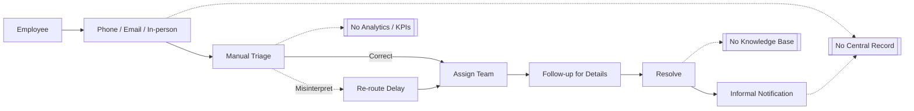

# Project Overview

> Ticket Team is an intelligent helpdesk platform designed to transform support operations at La Verdad Christian College. By combining a centralized ticketing system with AI-powered assistance through Retrieval-Augmented Generation (RAG), the system reduces resolution times, improves knowledge retention, and delivers transparent, data-driven service management.

## Table of Contents
- [1-B Technical Background](#1-b-technical-background)
  - [1-B.1 Current Process](#1-b1-current-process)
  - [1-B.2 Proposed System: Ticket-Team](#1-b2-proposed-system-ticket-team)
  - [Figures](#figures)
- [1.4 Scope and Delimitations](#14-scope-and-delimitations)
- [References](#references)

## 1-B Technical Background
This section details the operational context and technical foundation of the "Ticket-Team" system. It first outlines the current manual process for managing MIS concerns at La Verdad Christian College, identifying its inherent inefficiencies. It then presents the proposed system, detailing its architecture, technology stack, and functional flow through a series of system diagrams.

### 1-B.1 Current Process
The current procedure for managing the Management Information Systems (MIS) Department at La Verdad Christian College is a manual system reliant on informal communication. While functional for individual issues, this process presents several operational inefficiencies that impact service delivery and departmental performance. The key stages of this workflow and their associated challenges are outlined below.

- **Reporting Channels**: Employees report issues through multiple non-standardized channels, including direct phone calls, emails, and in-person visits. The absence of a centralized submission system leads to several negative outcomes: requests often lack the necessary detail for immediate action, there is a tangible risk of concerns being misplaced or forgotten, and no formal record exists to track submission times or history.
- **Triage and Assignment**: Concerns are triaged manually by available MIS staff, who must interpret the problem and assign it to the correct team (Technical or Development). This step can become a processing bottleneck, as the availability of personnel directly impacts response time. Any misinterpretation or incorrect assignment results in rerouting delays and a longer resolution lifecycle for the request.
- **Information Gathering**: Submissions frequently require a follow-up communication cycle to obtain essential details like error messages or user context. This iterative process extends the time required to resolve the issue and can hinder the productivity of the employee awaiting a solution.
- **Resolution and Notification**: The notification of a resolution is typically handled informally through chat or verbal updates. This approach lacks standardization and can create ambiguity regarding a ticket's final status, leaving no formal closure record.
- **Documentation and Analysis**: Perhaps the most significant strategic weakness is the absence of a centralized documentation system. Without a repository of past issues and solutions, the MIS department cannot effectively track recurring problems, measure performance metrics, or generate data-driven reports. This limits the ability to make informed decisions about infrastructure needs, staff training, or preventative maintenance.

#### Figure 1: Current Process Flow Diagram


### 1-B.2 Proposed System: Ticket-Team
To address the limitations of the current process, this study proposes the "Ticket-Team" system, a centralized, intelligent helpdesk platform. The system is designed from the ground up to introduce efficiency, transparency, and data-driven management into the MIS support lifecycle.

The proposed "Ticket-Team" system introduces a structured, intelligent, and transparent workflow that directly solves the inefficiencies of the current manual process. This new process establishes a single, centralized point of entry for all support requests and leverages an AI-powered funnel to resolve issues efficiently. The key improvements include proactive self-service via an AI chatbot, streamlined ticket submission, automated notifications, and a continuous knowledge growth loop that makes the system smarter over time. The following diagram illustrates this optimized and efficient process flow.

#### Figure 2: Proposed System Process Flow Diagram
```mermaid
flowchart LR
  subgraph AI_Support_Funnel [AI Support Funnel]
    Chatbot[AI Chatbot (RAG)]
    Suggest[AI Assistant Suggestions]
  end

  Employee[Employee] --> Chatbot
  Chatbot -->|Resolved| Resolved((Resolved))
  Chatbot -->|Escalate| TicketForm[Ticket Form (pre-populated with chat)]
  TicketForm --> Suggest
  Suggest -->|Self-serve success| Resolved
  TicketForm --> Validate[Validate Inputs]
  Validate --> Create[Create Ticket (Open)]
  Create --> Notify[Automated Notifications]
  Create --> Dashboard[MIS Staff Dashboard]

  subgraph Ticketing_Engine [Ticketing Engine]
    Dashboard --> Work[Assignment / Work In Progress]
    Work --> Comments[Comments & History (Unalterable)]
    Work --> Resolve[Resolution]
    Resolve --> Feedback[Employee Feedback & Rating]
  end

  subgraph Knowledge_Loop [Knowledge Growth Loop]
    Resolve --> Synthesize[AI-assisted KB Draft]
    Synthesize --> Publish[Publish Article]
    Publish --> Embed[Generate Embedding (pgvector)]
  end

  Feedback --> Analytics[Analytics & Reporting]
  Publish --> KB[KB Search Improves]
  Embed --> KB
```

### Figures
- Figure 1: Current Process Flow Diagram
- Figure 2: Proposed System Process Flow Diagram

## 1.4 Scope and Delimitations

### Scope
The project covers the design, development, and implementation of a centralized helpdesk ticketing platform for the Management Information Systems (MIS) department at La Verdad Christian College. The system's core scope encompasses the following functionalities:

- **End-to-End Ticket Management**: Manage the entire lifecycle of a support ticket, from initial submission by an employee to resolution and feedback, including ticket creation, status tracking, categorization, and a complete communication history log.
- **Role-Based Access Control**: Support four distinct user roles: Employee, MIS Staff, Administrator, and Super Administrator, each with a specific set of permissions and views tailored to their functions.
  - Administrator can manage users (create/update/deactivate) except `super_admin` governance (reserved for Super Administrator).
  - Feedback is readable and manageable only by `super_admin`; employees can submit feedback but cannot view it.
  - Comments & history are unalterable (immutable audit trail). No hard deletes; use status transitions and soft-deletes where applicable (e.g., attachments).
- **AI-Powered Support Funnel**: Integrated AI support funnel powered by a Retrieval-Augmented Generation (RAG) architecture using the Gemini API, including:
  - Conversational AI Chatbot for first-line support.
  - AI Assistant that provides proactive knowledge base suggestions during ticket submission.
  - AI-assisted content creation for MIS staff to convert resolved tickets into knowledge base articles.
- **Knowledge Base Management**: Fully functional, searchable knowledge base for self-help and institutional knowledge retention.
- **Analytics and Reporting**: Dashboard for administrators to view KPIs such as ticket volume, resolution times, and user satisfaction ratings.

The study will focus on evaluating the system's effectiveness in improving the efficiency of the MIS department's support process and the satisfaction of its end-users within the LVCC campus.

### Delimitations
To ensure the project remains focused and achievable within the defined timeframe, the following aspects are explicitly outside the scope of this study:

- **Inter-Departmental Ticketing**: A one-way support channel to MIS only; no multi-department queues or inter-department assignments.
- **Financial and Asset Management**: Not an asset management or budget tracking system.
- **Direct System Integration**: Functions as a standalone system; no direct integration with other institutional systems (e.g., SIS, HRIS).
- **Native Mobile Application**: Responsive web only; no native iOS/Android app.
- **Student-Facing Portal**: Internal use for employees (faculty/staff) only.
- **Custom AI Model Development**: Uses Gemini API; no custom model training/fine-tuning.

## References
- See also: [System Architecture](../02-architecture/system-architecture.md)
- See also: [System Features](../03-features/feature-list.md)
- See also: [Security Considerations](../02-architecture/system-architecture.md#1-b6-security-considerations)
