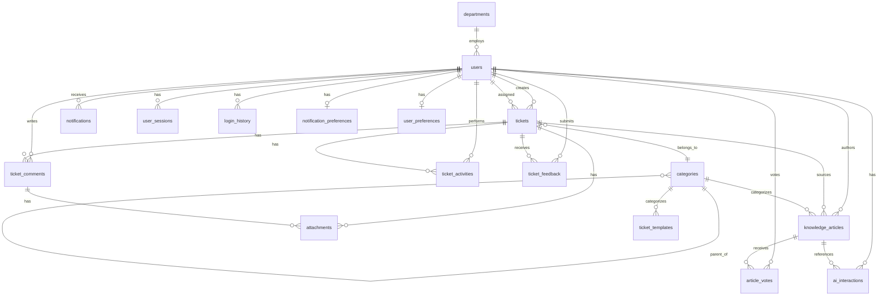

# Database Schema - Complete Reference

**Last Updated**: December 21, 2025  
**Version**: 1.0.0  
**Database**: PostgreSQL 15+ (Supabase)  
**Extensions**: pgvector, uuid-ossp

---

## Table of Contents
- [Overview](#overview)
- [Database Statistics](#database-statistics)
- [Core Tables](#core-tables)
- [Supporting Tables](#supporting-tables)
- [Security & Preferences Tables](#security--preferences-tables)
- [Custom Types](#custom-types)
- [Entity Relationship Diagram](#entity-relationship-diagram)
- [Complete Data Dictionary](#complete-data-dictionary)
- [Indexes & Performance](#indexes--performance)
- [RLS Policies](#rls-policies)
- [Triggers & Functions](#triggers--functions)
- [Migrations](#migrations)

---

## Overview

The Ticket Team database is designed with the following principles:
- **Normalized structure** for data integrity
- **Immutable audit trails** for compliance
- **Row Level Security (RLS)** on all tables
- **Vector embeddings** for semantic search (pgvector)
- **Soft deletes** where appropriate
- **Comprehensive indexing** for performance

---

## Database Statistics

| Metric | Count |
|--------|-------|
| **Total Tables** | 19 |
| **Custom Types** | 5 |
| **Migrations** | 30 |
| **Indexes** | 62+ |
| **RLS Policies** | 50+ |
| **Triggers** | 15+ |
| **Functions** | 10+ |

---

## Core Tables

### 1. users
**Purpose**: User profiles with RBAC (extends Supabase auth.users)

**Schema**:
```sql
CREATE TABLE users (
  id UUID PRIMARY KEY REFERENCES auth.users(id) ON DELETE CASCADE,
  email TEXT UNIQUE NOT NULL,
  full_name TEXT NOT NULL,
  role user_role NOT NULL DEFAULT 'employee',
  department TEXT,
  position TEXT,
  phone TEXT,
  bio TEXT,
  avatar_url TEXT,
  created_at TIMESTAMPTZ NOT NULL DEFAULT NOW(),
  updated_at TIMESTAMPTZ NOT NULL DEFAULT NOW(),
  last_login TIMESTAMPTZ,
  deactivated_at TIMESTAMPTZ,
  deactivated_by UUID REFERENCES users(id)
);
```

**Indexes**:
- `idx_users_email` (unique)
- `idx_users_role`
- `idx_users_department`
- `idx_users_deactivated_at`
- `idx_users_last_login`

**RLS**: Enabled - Users can view own profile, admins can view all

---

### 2. tickets
**Purpose**: Support ticket management

**Schema**:
```sql
CREATE TABLE tickets (
  id UUID PRIMARY KEY DEFAULT gen_random_uuid(),
  title TEXT NOT NULL,
  description TEXT NOT NULL,
  status ticket_status NOT NULL DEFAULT 'open',
  priority ticket_priority NOT NULL DEFAULT 'medium',
  category_id UUID REFERENCES categories(id),
  user_id UUID NOT NULL REFERENCES users(id),
  assigned_to UUID REFERENCES users(id),
  resolution_notes TEXT,
  metadata JSONB DEFAULT '{}'::jsonb,
  created_at TIMESTAMPTZ NOT NULL DEFAULT NOW(),
  created_by UUID NOT NULL REFERENCES users(id),
  updated_at TIMESTAMPTZ NOT NULL DEFAULT NOW(),
  updated_by UUID REFERENCES users(id),
  resolved_at TIMESTAMPTZ,
  closed_at TIMESTAMPTZ,
  first_response_at TIMESTAMPTZ
);
```

**Indexes**:
- `idx_tickets_status`
- `idx_tickets_priority`
- `idx_tickets_user_id`
- `idx_tickets_assigned_to`
- `idx_tickets_assigned_status` (composite)
- `idx_tickets_category_id`
- `idx_tickets_created_at`
- `idx_tickets_first_response_at`

**RLS**: Enabled - Users see own tickets, staff see assigned, admins see all

---

### 3. ticket_comments
**Purpose**: Immutable comment thread on tickets

**Schema**:
```sql
CREATE TABLE ticket_comments (
  id UUID PRIMARY KEY DEFAULT gen_random_uuid(),
  ticket_id UUID NOT NULL REFERENCES tickets(id) ON DELETE CASCADE,
  user_id UUID NOT NULL REFERENCES users(id),
  content TEXT NOT NULL,
  is_internal BOOLEAN NOT NULL DEFAULT false,
  attachments JSONB DEFAULT '[]'::jsonb,
  created_at TIMESTAMPTZ NOT NULL DEFAULT NOW()
);
```

**Indexes**:
- `idx_ticket_comments_ticket_id`
- `idx_ticket_comments_user_id`
- `idx_ticket_comments_created_at`

**RLS**: Enabled - Users see public comments on own tickets, staff see all

**Immutability**: No UPDATE or DELETE allowed (enforced by RLS)

---

### 4. ticket_activities
**Purpose**: Immutable audit trail for all ticket changes

**Schema**:
```sql
CREATE TABLE ticket_activities (
  id UUID PRIMARY KEY DEFAULT gen_random_uuid(),
  ticket_id UUID NOT NULL REFERENCES tickets(id) ON DELETE CASCADE,
  user_id UUID REFERENCES users(id) ON DELETE SET NULL,
  action TEXT NOT NULL,
  old_value TEXT,
  new_value TEXT,
  metadata JSONB DEFAULT '{}'::jsonb,
  created_at TIMESTAMPTZ NOT NULL DEFAULT NOW()
);
```

**Indexes**:
- `idx_ticket_activities_ticket_id`
- `idx_ticket_activities_user_id`
- `idx_ticket_activities_action`
- `idx_ticket_activities_created_at`

**RLS**: Enabled - Users see activities on own tickets, admins see all

**Immutability**: No UPDATE or DELETE allowed (enforced by RLS)

---

### 5. ticket_feedback
**Purpose**: Post-resolution satisfaction ratings

**Schema**:
```sql
CREATE TABLE ticket_feedback (
  id UUID PRIMARY KEY DEFAULT gen_random_uuid(),
  ticket_id UUID NOT NULL REFERENCES tickets(id) ON DELETE CASCADE,
  user_id UUID NOT NULL REFERENCES users(id),
  rating INTEGER NOT NULL CHECK (rating >= 1 AND rating <= 5),
  comment TEXT,
  created_at TIMESTAMPTZ NOT NULL DEFAULT NOW(),
  UNIQUE(ticket_id, user_id)
);
```

**Indexes**:
- `idx_ticket_feedback_ticket_id`
- `idx_ticket_feedback_rating`

**RLS**: Enabled - Users can create/view own feedback, admins see all

**Immutability**: No UPDATE or DELETE allowed

---

### 6. knowledge_articles
**Purpose**: Knowledge base with vector embeddings

**Schema**:
```sql
CREATE TABLE knowledge_articles (
  id UUID PRIMARY KEY DEFAULT gen_random_uuid(),
  title TEXT NOT NULL,
  summary TEXT,
  content TEXT NOT NULL,
  author_id UUID NOT NULL REFERENCES users(id),
  category_id UUID REFERENCES categories(id),
  tags TEXT[] DEFAULT ARRAY[]::TEXT[],
  status article_status NOT NULL DEFAULT 'draft',
  embedding vector(768), -- Gemini text-embedding-004
  view_count INTEGER NOT NULL DEFAULT 0,
  helpful_count INTEGER NOT NULL DEFAULT 0,
  not_helpful_count INTEGER NOT NULL DEFAULT 0,
  source_ticket_id UUID REFERENCES tickets(id),
  created_at TIMESTAMPTZ NOT NULL DEFAULT NOW(),
  created_by UUID NOT NULL REFERENCES users(id),
  updated_at TIMESTAMPTZ NOT NULL DEFAULT NOW(),
  updated_by UUID REFERENCES users(id),
  published_at TIMESTAMPTZ,
  archived_at TIMESTAMPTZ
);
```

**Indexes**:
- `idx_knowledge_articles_status`
- `idx_knowledge_articles_author_id`
- `idx_knowledge_articles_category_id`
- `idx_knowledge_articles_embedding` (HNSW for vector search)
- `idx_knowledge_articles_tags` (GIN)
- `idx_knowledge_articles_view_count`

**RLS**: Enabled - All see published, staff+ see drafts, author sees own

---

### 7. article_votes
**Purpose**: Helpfulness voting for KB articles

**Schema**:
```sql
CREATE TABLE article_votes (
  id UUID PRIMARY KEY DEFAULT gen_random_uuid(),
  article_id UUID NOT NULL REFERENCES knowledge_articles(id) ON DELETE CASCADE,
  user_id UUID NOT NULL REFERENCES users(id),
  is_helpful BOOLEAN NOT NULL,
  feedback TEXT,
  created_at TIMESTAMPTZ NOT NULL DEFAULT NOW(),
  UNIQUE(article_id, user_id)
);
```

**Indexes**:
- `idx_article_votes_article_id`
- `idx_article_votes_user_id`

**RLS**: Enabled - Users can vote once per article

---

### 8. ai_interactions
**Purpose**: AI chat session tracking

**Schema**:
```sql
CREATE TABLE ai_interactions (
  id UUID PRIMARY KEY DEFAULT gen_random_uuid(),
  user_id UUID NOT NULL REFERENCES users(id),
  session_id TEXT NOT NULL,
  query TEXT NOT NULL,
  response TEXT NOT NULL,
  context_articles UUID[] DEFAULT ARRAY[]::UUID[],
  helpfulness_rating INTEGER CHECK (helpfulness_rating >= 1 AND helpfulness_rating <= 5),
  escalated_to_ticket_id UUID REFERENCES tickets(id),
  metadata JSONB DEFAULT '{}'::jsonb,
  created_at TIMESTAMPTZ NOT NULL DEFAULT NOW()
);
```

**Indexes**:
- `idx_ai_interactions_user_id`
- `idx_ai_interactions_session_id`
- `idx_ai_interactions_created_at`

**RLS**: Enabled - Users see own interactions, admins see all

---

## Supporting Tables

### 9. categories
**Purpose**: Hierarchical taxonomy for tickets and KB

**Schema**:
```sql
CREATE TABLE categories (
  id UUID PRIMARY KEY DEFAULT gen_random_uuid(),
  name TEXT NOT NULL,
  description TEXT,
  parent_id UUID REFERENCES categories(id),
  type TEXT NOT NULL CHECK (type IN ('ticket', 'kb', 'both')),
  display_order INTEGER NOT NULL DEFAULT 0,
  is_active BOOLEAN NOT NULL DEFAULT true,
  usage_count INTEGER NOT NULL DEFAULT 0,
  created_at TIMESTAMPTZ NOT NULL DEFAULT NOW(),
  updated_at TIMESTAMPTZ NOT NULL DEFAULT NOW()
);
```

**Indexes**:
- `idx_categories_parent_id`
- `idx_categories_type`
- `idx_categories_is_active`
- `idx_categories_display_order`

**RLS**: Enabled - All can view, staff+ can manage

---

### 10. attachments
**Purpose**: File upload metadata with soft delete

**Schema**:
```sql
CREATE TABLE attachments (
  id UUID PRIMARY KEY DEFAULT gen_random_uuid(),
  ticket_id UUID REFERENCES tickets(id) ON DELETE CASCADE,
  comment_id UUID REFERENCES ticket_comments(id) ON DELETE CASCADE,
  filename TEXT NOT NULL,
  storage_path TEXT NOT NULL,
  mime_type TEXT NOT NULL,
  file_size INTEGER NOT NULL,
  uploaded_by UUID NOT NULL REFERENCES users(id),
  created_at TIMESTAMPTZ NOT NULL DEFAULT NOW(),
  deleted_at TIMESTAMPTZ,
  deleted_by UUID REFERENCES users(id)
);
```

**Indexes**:
- `idx_attachments_ticket_id`
- `idx_attachments_comment_id`

**RLS**: Enabled - Users access attachments on accessible tickets

---

### 11. notifications
**Purpose**: User notification system

**Schema**:
```sql
CREATE TABLE notifications (
  id UUID PRIMARY KEY DEFAULT gen_random_uuid(),
  user_id UUID NOT NULL REFERENCES users(id) ON DELETE CASCADE,
  type TEXT NOT NULL,
  title TEXT NOT NULL,
  message TEXT NOT NULL,
  link TEXT,
  is_read BOOLEAN NOT NULL DEFAULT false,
  metadata JSONB DEFAULT '{}'::jsonb,
  created_at TIMESTAMPTZ NOT NULL DEFAULT NOW(),
  read_at TIMESTAMPTZ
);
```

**Indexes**:
- `idx_notifications_user_id`
- `idx_notifications_is_read`
- `idx_notifications_created_at`

**RLS**: Enabled - Users see only own notifications

---

### 12. ticket_templates
**Purpose**: Reusable ticket templates

**Schema**:
```sql
CREATE TABLE ticket_templates (
  id UUID PRIMARY KEY DEFAULT gen_random_uuid(),
  name TEXT NOT NULL,
  description TEXT,
  title_template TEXT NOT NULL,
  description_template TEXT NOT NULL,
  category_id UUID REFERENCES categories(id),
  priority ticket_priority NOT NULL DEFAULT 'medium',
  tags TEXT[] DEFAULT ARRAY[]::TEXT[],
  usage_count INTEGER NOT NULL DEFAULT 0,
  is_active BOOLEAN NOT NULL DEFAULT true,
  created_by UUID NOT NULL REFERENCES users(id),
  created_at TIMESTAMPTZ NOT NULL DEFAULT NOW(),
  updated_at TIMESTAMPTZ NOT NULL DEFAULT NOW()
);
```

**Indexes**:
- `idx_ticket_templates_category_id`
- `idx_ticket_templates_is_active`
- `idx_ticket_templates_usage_count`

**RLS**: Enabled - All can view, staff+ can manage

---

### 13. canned_responses
**Purpose**: Quick reply templates

**Schema**:
```sql
CREATE TABLE canned_responses (
  id UUID PRIMARY KEY DEFAULT gen_random_uuid(),
  title TEXT NOT NULL,
  content TEXT NOT NULL,
  shortcut TEXT UNIQUE,
  category TEXT,
  usage_count INTEGER NOT NULL DEFAULT 0,
  is_active BOOLEAN NOT NULL DEFAULT true,
  created_by UUID NOT NULL REFERENCES users(id),
  created_at TIMESTAMPTZ NOT NULL DEFAULT NOW(),
  updated_at TIMESTAMPTZ NOT NULL DEFAULT NOW()
);
```

**Indexes**:
- `idx_canned_responses_shortcut` (unique)
- `idx_canned_responses_category`
- `idx_canned_responses_usage_count`

**RLS**: Enabled - Staff+ can access

---

### 14. departments
**Purpose**: Organizational structure

**Schema**:
```sql
CREATE TABLE departments (
  id UUID PRIMARY KEY DEFAULT gen_random_uuid(),
  name TEXT UNIQUE NOT NULL,
  description TEXT,
  head_id UUID REFERENCES users(id),
  display_order INTEGER NOT NULL DEFAULT 0,
  is_active BOOLEAN NOT NULL DEFAULT true,
  created_at TIMESTAMPTZ NOT NULL DEFAULT NOW(),
  updated_at TIMESTAMPTZ NOT NULL DEFAULT NOW()
);
```

**Indexes**:
- `idx_departments_name` (unique)
- `idx_departments_display_order`

**RLS**: Enabled - All can view, admins can manage

---

### 15. system_settings
**Purpose**: Global application configuration

**Schema**:
```sql
CREATE TABLE system_settings (
  id UUID PRIMARY KEY DEFAULT gen_random_uuid(),
  key TEXT UNIQUE NOT NULL,
  value JSONB NOT NULL,
  description TEXT,
  updated_by UUID REFERENCES users(id),
  updated_at TIMESTAMPTZ NOT NULL DEFAULT NOW()
);
```

**Indexes**:
- `idx_system_settings_key` (unique)

**RLS**: Enabled - Admins only

---

## Security & Preferences Tables

### 16. user_sessions
**Purpose**: Session tracking and management

**Schema**:
```sql
CREATE TABLE user_sessions (
  id UUID PRIMARY KEY DEFAULT gen_random_uuid(),
  user_id UUID NOT NULL REFERENCES users(id) ON DELETE CASCADE,
  session_token TEXT NOT NULL,
  device_info TEXT,
  ip_address INET,
  user_agent TEXT,
  last_active_at TIMESTAMPTZ NOT NULL DEFAULT NOW(),
  expires_at TIMESTAMPTZ NOT NULL,
  created_at TIMESTAMPTZ NOT NULL DEFAULT NOW()
);
```

**Indexes**:
- `idx_user_sessions_user_id`
- `idx_user_sessions_session_token`
- `idx_user_sessions_expires_at`

**RLS**: Enabled - Users see only own sessions

---

### 17. login_history
**Purpose**: Security audit trail

**Schema**:
```sql
CREATE TABLE login_history (
  id UUID PRIMARY KEY DEFAULT gen_random_uuid(),
  user_id UUID NOT NULL REFERENCES users(id) ON DELETE CASCADE,
  login_at TIMESTAMPTZ NOT NULL DEFAULT NOW(),
  ip_address INET,
  user_agent TEXT,
  device_info TEXT,
  location TEXT,
  success BOOLEAN NOT NULL DEFAULT true,
  failure_reason TEXT
);
```

**Indexes**:
- `idx_login_history_user_id`
- `idx_login_history_login_at`

**RLS**: Enabled - Users see only own history

---

### 18. notification_preferences
**Purpose**: User notification settings

**Schema**:
```sql
CREATE TABLE notification_preferences (
  user_id UUID PRIMARY KEY REFERENCES users(id) ON DELETE CASCADE,
  email_enabled BOOLEAN NOT NULL DEFAULT true,
  in_app_enabled BOOLEAN NOT NULL DEFAULT true,
  ticket_assigned_email BOOLEAN NOT NULL DEFAULT true,
  ticket_assigned_app BOOLEAN NOT NULL DEFAULT true,
  ticket_comment_email BOOLEAN NOT NULL DEFAULT true,
  ticket_comment_app BOOLEAN NOT NULL DEFAULT true,
  ticket_status_changed_email BOOLEAN NOT NULL DEFAULT true,
  ticket_status_changed_app BOOLEAN NOT NULL DEFAULT true,
  ticket_priority_changed_email BOOLEAN NOT NULL DEFAULT false,
  ticket_priority_changed_app BOOLEAN NOT NULL DEFAULT true,
  mention_email BOOLEAN NOT NULL DEFAULT true,
  mention_app BOOLEAN NOT NULL DEFAULT true,
  kb_article_published_email BOOLEAN NOT NULL DEFAULT false,
  kb_article_published_app BOOLEAN NOT NULL DEFAULT true,
  kb_article_updated_email BOOLEAN NOT NULL DEFAULT false,
  kb_article_updated_app BOOLEAN NOT NULL DEFAULT false,
  digest_frequency TEXT NOT NULL DEFAULT 'realtime',
  digest_time TIME,
  quiet_hours_enabled BOOLEAN NOT NULL DEFAULT false,
  quiet_hours_start TIME,
  quiet_hours_end TIME,
  created_at TIMESTAMPTZ NOT NULL DEFAULT NOW(),
  updated_at TIMESTAMPTZ NOT NULL DEFAULT NOW()
);
```

**Indexes**:
- Primary key on `user_id`

**RLS**: Enabled - Users manage only own preferences

---

### 19. user_preferences
**Purpose**: User application preferences

**Schema**:
```sql
CREATE TABLE user_preferences (
  user_id UUID PRIMARY KEY REFERENCES users(id) ON DELETE CASCADE,
  theme TEXT NOT NULL DEFAULT 'system',
  font_size TEXT NOT NULL DEFAULT 'medium',
  compact_mode BOOLEAN NOT NULL DEFAULT false,
  sidebar_collapsed BOOLEAN NOT NULL DEFAULT false,
  timezone TEXT NOT NULL DEFAULT 'UTC',
  date_format TEXT NOT NULL DEFAULT 'MM/DD/YYYY',
  time_format TEXT NOT NULL DEFAULT '12h',
  language TEXT NOT NULL DEFAULT 'en',
  dashboard_widgets JSONB DEFAULT '[]'::jsonb,
  widget_order JSONB DEFAULT '[]'::jsonb,
  default_view TEXT NOT NULL DEFAULT 'grid',
  items_per_page INTEGER NOT NULL DEFAULT 20,
  created_at TIMESTAMPTZ NOT NULL DEFAULT NOW(),
  updated_at TIMESTAMPTZ NOT NULL DEFAULT NOW()
);
```

**Indexes**:
- Primary key on `user_id`

**RLS**: Enabled - Users manage only own preferences

---

## Custom Types

```sql
-- User role hierarchy
CREATE TYPE user_role AS ENUM (
  'employee',    -- Submit tickets, view own tickets
  'staff',       -- Manage assigned tickets, create KB
  'admin',       -- User management (except super_admins)
  'super_admin'  -- Full access including feedback analytics
);

-- Ticket lifecycle states
CREATE TYPE ticket_status AS ENUM (
  'open',        -- Initial state
  'in_progress', -- Being worked on
  'on_hold',     -- Waiting for external input
  'resolved',    -- Solution provided
  'closed',      -- Confirmed resolved
  'canceled'     -- Abandoned
);

-- Ticket priority levels
CREATE TYPE ticket_priority AS ENUM (
  'low',
  'medium',
  'high'
);

-- KB article workflow
CREATE TYPE article_status AS ENUM (
  'draft',      -- Work in progress
  'published',  -- Live and searchable
  'archived'    -- Historical reference
);

-- Notification types
CREATE TYPE notification_type AS ENUM (
  'ticket_assigned',
  'ticket_comment',
  'ticket_status_changed',
  'ticket_priority_changed',
  'mention',
  'kb_article_published',
  'kb_article_updated'
);
```

---

## Entity Relationship Diagram



---

## Indexes & Performance

### Index Strategy
- **Primary Keys**: Automatic B-tree indexes
- **Foreign Keys**: Indexed for join performance
- **Status Fields**: Indexed for filtering
- **Timestamps**: Indexed for sorting/filtering
- **Vector Embeddings**: HNSW index for similarity search
- **JSONB Fields**: GIN indexes where queried

### Performance Targets
- Single-row lookups: < 1ms
- Filtered queries: < 50ms
- Vector search: < 100ms
- Full-text search: < 200ms
- Complex joins: < 500ms

---

## RLS Policies

### Policy Categories
1. **SELECT Policies**: Who can read data
2. **INSERT Policies**: Who can create data
3. **UPDATE Policies**: Who can modify data
4. **DELETE Policies**: Who can remove data

### Common Patterns
- **Own Data**: Users access their own records
- **Role-Based**: Access based on user role
- **Relationship-Based**: Access via foreign keys
- **Immutable**: No UPDATE/DELETE allowed

### Example Policy
```sql
-- Users can view their own tickets
CREATE POLICY "Users can view own tickets"
ON tickets FOR SELECT
USING (user_id = auth.uid());

-- Staff can view assigned tickets
CREATE POLICY "Staff can view assigned tickets"
ON tickets FOR SELECT
USING (
  assigned_to = auth.uid() 
  AND (SELECT role FROM users WHERE id = auth.uid()) IN ('staff', 'admin', 'super_admin')
);
```

---

## Triggers & Functions

### Automatic Triggers
1. **updated_at**: Auto-update timestamp on row change
2. **Activity Logging**: Log ticket changes to ticket_activities
3. **Notification Creation**: Create notifications on events
4. **Usage Count**: Increment template/response usage
5. **First Response**: Track first staff response time

### Custom Functions
1. **match_kb_articles**: Vector similarity search
2. **increment_usage_count**: Atomic counter increment
3. **create_notification**: Notification helper
4. **update_ticket_activity**: Activity logging
5. **get_user_role**: Role lookup helper

---

## Migrations

### Migration Strategy
- **Sequential Naming**: `YYYYMMDDNNNNNN_description.sql`
- **Never Modify**: Existing migrations are immutable
- **Forward Only**: No rollback migrations
- **Idempotent**: Safe to run multiple times

### Migration Categories
1. **Schema**: Table/column creation
2. **Data**: Seed data, transformations
3. **Indexes**: Performance optimization
4. **RLS**: Security policies
5. **Functions**: Custom database logic

### Total Migrations: 30

---

## Related Documentation

- [System Architecture](./system-architecture.md)
- [Security & Preferences](../03-features/security-preferences.md)
- [Performance Monitoring](../03-features/performance-monitoring.md)
- [API Documentation](../04-api/endpoints.md)

---

**Last Updated**: December 21, 2025  
**Version**: 1.0.0  
**Status**: ✅ Production Ready

