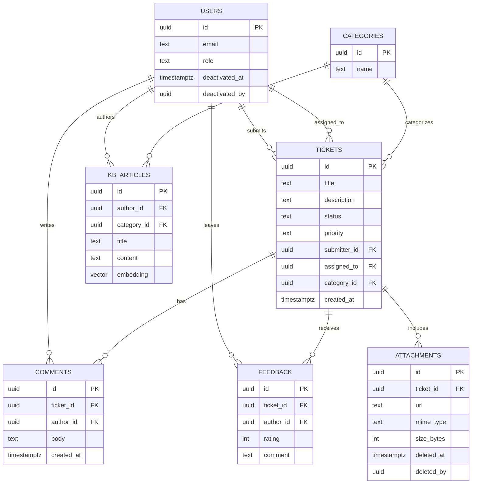

# Database Schema

> Database structure, entities, and relationships.

## Table of Contents
- [1-B.5 Data Model](#1-b5-data-model)
  - [Core Entities](#core-entities)
  - [Supporting Entities](#supporting-entities)
  - [ERD](#erd)
  - [Indexes and Constraints](#indexes-and-constraints)
- [Data Dictionary](#data-dictionary)
  - [Users](#users)
  - [Tickets](#tickets-1)
  - [Comments](#comments-1)
  - [Feedback](#feedback-1)
  - [Categories](#categories-1)
  - [KB Articles](#kb-articles)
  - [Attachments](#attachments)
- [References](#references)

## 1-B.5 Data Model
The data model is normalized for integrity and analytical querying. PostgreSQL (via Supabase) is the system of record. `pgvector` provides semantic search over Knowledge Base content to power RAG.

### Core Entities
- **Users**: Source of truth for authenticated actors. Stores profile information and a role attribute (e.g., `employee`, `staff`, `admin`, `super_admin`). Drives security and access.
- **Tickets**: Central transactional entity for support requests. Tracks description, status, priority, submitter, and the assigned MIS staff member. Status/priority as enums to ensure consistency.

### Supporting Entities
- **Comments**: Chronological communication linked to a single Ticket and the User who posted it; forms a complete resolution log.
- **Knowledge Base Articles**: Article title, content, author, and an embedding vector column (via `pgvector`) for high-speed semantic search in RAG.
- **Categories**: Controlled list shared by Tickets and Knowledge Base Articles to enforce consistent taxonomy.
- **Feedback**: Ratings and qualitative comments for resolved tickets to measure satisfaction and feed analytics.
- **Attachments**: Files uploaded to tickets (stored via Supabase Storage) with metadata.

### ERD


### Indexes and Constraints
- Foreign keys enforce referential integrity between entities.
- Unique constraints on user identities; controlled enum values for status/priority.
 - No hard deletes for auditability; prefer soft-delete fields and status transitions.

#### Example
```sql
CREATE INDEX IF NOT EXISTS idx_tickets_status ON tickets(status);
```

## Data Dictionary

### Users
- **id (uuid, PK)**: Unique user identifier (maps to `auth.users.id`).
- **email (text)**: Email address.
- **role (text)**: `employee | staff | admin | super_admin`.
- **deactivated_at (timestamptz, nullable)**: When the account was deactivated.
- **deactivated_by (uuid, nullable)**: Who deactivated the account.

### Tickets
- **id (uuid, PK)**: Ticket identifier.
- **title (text)**: Short summary (3–120 chars typical).
- **description (text)**: Detailed description.
- **status (text)**: `Open | In Progress | On Hold | Resolved | Closed | Canceled`.
- **priority (text)**: `Low | Medium | High`.
- **submitter_id (uuid, FK→users.id)**: Employee who created the ticket.
- **assigned_to (uuid, FK→users.id)**: MIS staff assigned.
- **category_id (uuid, FK→categories.id)**: Category.
- **created_at (timestamptz)**: Creation timestamp.

### Comments
- **id (uuid, PK)**: Comment identifier.
- **ticket_id (uuid, FK→tickets.id)**: Parent ticket.
- **author_id (uuid, FK→users.id)**: Comment author.
- **body (text)**: Comment text.
- **created_at (timestamptz)**: Creation timestamp.

### Feedback
- **id (uuid, PK)**: Feedback identifier.
- **ticket_id (uuid, FK→tickets.id)**: Related ticket.
- **author_id (uuid, FK→users.id)**: Employee leaving feedback.
- **rating (int)**: 1–5 rating.
- **comment (text)**: Optional comment.
  - Insert by ticket submitter; readable/manageable only by `super_admin`; immutable.

### Categories
- **id (uuid, PK)**: Category identifier.
- **name (text)**: Category name (unique).

### KB Articles
- **id (uuid, PK)**: Article identifier.
- **author_id (uuid, FK→users.id)**: Author.
- **category_id (uuid, FK→categories.id)**: Category.
- **title (text)**: Article title.
- **content (text)**: Markdown/HTML content.
- **embedding (vector)**: pgvector embedding for RAG.

### Attachments
- **id (uuid, PK)**: Attachment identifier.
- **ticket_id (uuid, FK→tickets.id)**: Parent ticket.
- **url (text)**: Storage URL.
- **mime_type (text)**: MIME type.
- **size_bytes (int)**: File size in bytes.
 - **deleted_at (timestamptz, nullable)**: Soft-delete timestamp.
 - **deleted_by (uuid, nullable)**: Who soft-deleted the attachment.

## References
- See also: [System Architecture](./system-architecture.md)
- See also: [API Endpoints](../04-api/endpoints.md)
