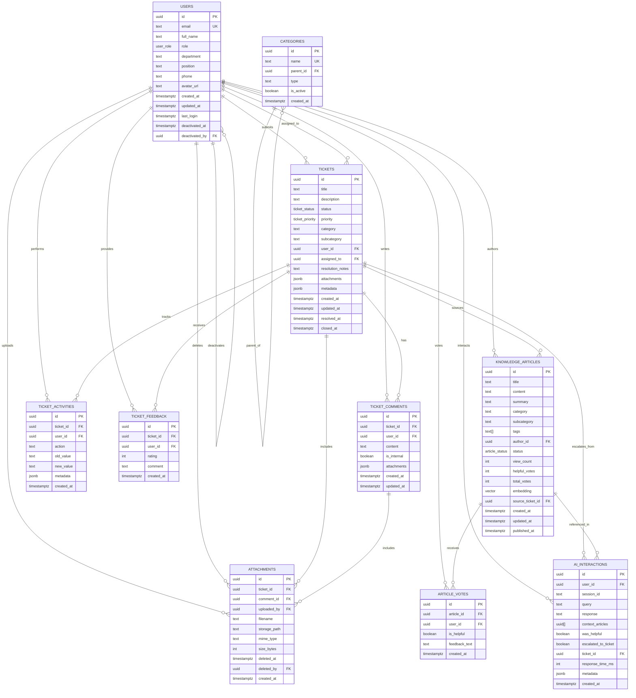

# Database Schema

> Database structure, entities, and relationships.

## Table of Contents
- [1-B.5 Data Model](#1-b5-data-model)
  - [Core Entities](#core-entities)
  - [Supporting Entities](#supporting-entities)
  - [PostgreSQL Custom Types](#postgresql-custom-types)
  - [ERD](#erd)
  - [Indexes and Constraints](#indexes-and-constraints)
- [Data Dictionary](#data-dictionary)
  - [Users](#users)
  - [Tickets](#tickets-1)
  - [Ticket Comments](#ticket-comments)
  - [Ticket Activities](#ticket-activities)
  - [Ticket Feedback](#ticket-feedback)
  - [Categories](#categories-1)
  - [Knowledge Articles](#knowledge-articles)
  - [Article Votes](#article-votes)
  - [AI Interactions](#ai-interactions)
  - [Attachments](#attachments)
- [References](#references)

## 1-B.5 Data Model
The data model is normalized for integrity and analytical querying. PostgreSQL (via Supabase) is the system of record. `pgvector` provides semantic search over Knowledge Base content to power RAG.

### Core Entities
- **Users**: Source of truth for authenticated actors. Stores comprehensive profile information including full name, department, position, contact details, and role-based access control (RBAC) via the `user_role` enum. Linked to Supabase Auth. Supports soft deactivation for audit trails.
- **Tickets**: Central transactional entity for support requests. Tracks title, description, status (enum), priority (enum), category, submitter, assigned staff, resolution notes, and temporal markers (created, updated, resolved, closed). Supports structured metadata via JSONB.
- **Ticket Activities**: Comprehensive audit trail for all ticket lifecycle events. Captures action type, user, old/new values, and metadata for complete change history and compliance.
- **AI Interactions**: Tracks all AI assistant conversations including user queries, generated responses, referenced knowledge articles, helpfulness ratings, and escalation to tickets. Enables AI performance analytics and continuous improvement.

### Supporting Entities
- **Ticket Comments**: Chronological communication linked to tickets. Supports internal/external visibility flags for staff-only notes. Tracks attachments via JSONB references.
- **Ticket Feedback**: Post-resolution satisfaction ratings (1-5 scale) and qualitative comments from ticket submitters. One feedback per user per ticket. Immutable for analytics integrity.
- **Categories**: Hierarchical taxonomy shared by Tickets and Knowledge Articles. Two-level structure (parent category → subcategory) enforces controlled vocabulary and consistent classification. Supports filtering by type and active status.
- **Knowledge Articles**: Rich content repository with title, summary, body, author, category, tags, and status workflow (draft → published → archived). Includes pgvector embeddings (1536 dimensions) for semantic search in RAG. Tracks engagement metrics (view count, votes) and can be linked to source tickets.
- **Article Votes**: Quality feedback mechanism for knowledge base articles. Users rate helpfulness and provide optional textual feedback to improve content quality.
- **Attachments**: Files uploaded to tickets or comments, stored via Supabase Storage. Tracks filename, storage path, MIME type, file size, uploader, and supports soft deletion with audit fields (deleted_at, deleted_by).

### PostgreSQL Custom Types
The schema uses PostgreSQL ENUM types for type safety and data integrity. These enforce controlled vocabularies at the database level.

```sql
-- User role hierarchy for RBAC
CREATE TYPE user_role AS ENUM ('employee', 'staff', 'admin', 'super_admin');

-- Ticket lifecycle states
CREATE TYPE ticket_status AS ENUM ('open', 'in_progress', 'on_hold', 'resolved', 'closed', 'canceled');

-- Ticket priority levels
CREATE TYPE ticket_priority AS ENUM ('low', 'medium', 'high');

-- Knowledge article publication workflow
CREATE TYPE article_status AS ENUM ('draft', 'published', 'archived');
```

### ERD


### Indexes and Constraints

#### Integrity Constraints
- **Foreign keys** enforce referential integrity across all entity relationships
- **Unique constraints** on `users.email`, `categories.name`, and composite `(ticket_id, user_id)` for feedback/votes
- **Check constraints** validate data quality:
  - Minimum length requirements (e.g., title ≥ 5 chars, content ≥ 10 chars)
  - Rating ranges (1–5 for feedback)
  - Non-empty required fields (session_id, category, content)
- **ENUM types** enforce controlled vocabularies for status, priority, role, and article status
- **No hard deletes** for auditability; use soft-delete fields (`deleted_at`, `deactivated_at`) and status transitions

#### Performance Indexes

**Core Query Optimization:**
```sql
-- Ticket querying and filtering
CREATE INDEX idx_tickets_status ON tickets(status);
CREATE INDEX idx_tickets_priority ON tickets(priority);
CREATE INDEX idx_tickets_user_id ON tickets(user_id);
CREATE INDEX idx_tickets_assigned_to ON tickets(assigned_to);
CREATE INDEX idx_tickets_created_at ON tickets(created_at DESC);
CREATE INDEX idx_tickets_status_priority ON tickets(status, priority);

-- Composite index for staff dashboard
CREATE INDEX idx_tickets_assigned_status ON tickets(assigned_to, status) 
  WHERE assigned_to IS NOT NULL;

-- Ticket activities audit trail
CREATE INDEX idx_ticket_activities_ticket_id ON ticket_activities(ticket_id);
CREATE INDEX idx_ticket_activities_created_at ON ticket_activities(created_at DESC);
```

**Knowledge Base & AI:**
```sql
-- Vector similarity search (HNSW for better performance)
CREATE INDEX idx_knowledge_articles_embedding ON knowledge_articles 
  USING hnsw (embedding vector_cosine_ops);

-- KB filtering and discovery
CREATE INDEX idx_knowledge_articles_status ON knowledge_articles(status);
CREATE INDEX idx_knowledge_articles_category ON knowledge_articles(category, subcategory);
CREATE INDEX idx_knowledge_articles_published_at ON knowledge_articles(published_at DESC) 
  WHERE status = 'published';

-- AI interaction analytics
CREATE INDEX idx_ai_interactions_user_id ON ai_interactions(user_id);
CREATE INDEX idx_ai_interactions_session_id ON ai_interactions(session_id);
CREATE INDEX idx_ai_interactions_created_at ON ai_interactions(created_at DESC);
CREATE INDEX idx_ai_interactions_escalated ON ai_interactions(escalated_to_ticket) 
  WHERE escalated_to_ticket = true;
```

**Comments & Activities:**
```sql
-- Ticket timeline queries
CREATE INDEX idx_ticket_comments_ticket_id ON ticket_comments(ticket_id);
CREATE INDEX idx_ticket_comments_created_at ON ticket_comments(created_at);

-- User activity tracking
CREATE INDEX idx_ticket_activities_user_id ON ticket_activities(user_id);
```

**Foreign Key Indexes:**
```sql
-- Improve JOIN performance
CREATE INDEX idx_ticket_feedback_ticket_id ON ticket_feedback(ticket_id);
CREATE INDEX idx_article_votes_article_id ON article_votes(article_id);
CREATE INDEX idx_attachments_ticket_id ON attachments(ticket_id);
CREATE INDEX idx_attachments_comment_id ON attachments(comment_id) 
  WHERE comment_id IS NOT NULL;
CREATE INDEX idx_categories_parent_id ON categories(parent_id) 
  WHERE parent_id IS NOT NULL;
```

#### Full-Text Search (Optional)
```sql
-- Text search on tickets for non-AI keyword search
CREATE INDEX idx_tickets_search ON tickets 
  USING gin(to_tsvector('english', title || ' ' || description));

-- Text search on KB articles
CREATE INDEX idx_knowledge_articles_search ON knowledge_articles 
  USING gin(to_tsvector('english', title || ' ' || content));
```

## Data Dictionary

### Users
The users table stores comprehensive profile and authentication information for all system actors.

- **id (uuid, PK)**: Unique user identifier; foreign key to `auth.users.id` (Supabase Auth).
- **email (text, unique, not null)**: User's email address; primary authentication identifier.
- **full_name (text, not null)**: Complete name of the user for display purposes.
- **role (user_role, not null, default 'employee')**: Role-based access level enum:
  - `employee`: Standard user who can submit tickets
  - `staff`: MIS support staff who can be assigned tickets
  - `admin`: Department administrator with elevated permissions
  - `super_admin`: System administrator with full access
- **department (text, nullable)**: Organizational department (e.g., "Finance", "HR").
- **position (text, nullable)**: Job title or position within organization.
- **phone (text, nullable)**: Contact phone number.
- **avatar_url (text, nullable)**: URL to user's profile picture (Supabase Storage path).
- **created_at (timestamptz, not null, default now())**: Account creation timestamp.
- **updated_at (timestamptz, not null, default now())**: Last profile update timestamp.
- **last_login (timestamptz, nullable)**: Most recent authentication timestamp.
- **deactivated_at (timestamptz, nullable)**: Soft-delete timestamp; when account was deactivated.
- **deactivated_by (uuid, nullable, FK→users.id)**: Administrator who deactivated this account.

### Tickets
The tickets table is the central entity for support requests, tracking the complete lifecycle from submission to resolution.

- **id (uuid, PK, default gen_random_uuid())**: Unique ticket identifier.
- **title (text, not null, check length ≥ 5)**: Brief summary of the issue or request.
- **description (text, not null, check length ≥ 10)**: Detailed explanation of the problem, impact, and context.
- **status (ticket_status, not null, default 'open')**: Current lifecycle state:
  - `open`: Newly created, awaiting assignment
  - `in_progress`: Actively being worked on by staff
  - `on_hold`: Waiting for external input or dependencies
  - `resolved`: Solution implemented, awaiting user confirmation
  - `closed`: Confirmed resolved by user or auto-closed
  - `canceled`: Withdrawn by submitter or deemed invalid
- **priority (ticket_priority, not null, default 'medium')**: Priority level:
  - `low`: Minor issues, no immediate business impact
  - `medium`: Standard priority, normal workflow disruption
  - `high`: Critical issues affecting business operations
- **category (text, not null)**: Primary classification (e.g., "Hardware", "Software", "Network").
- **subcategory (text, nullable)**: Secondary classification for finer granularity (e.g., "Printer", "Email Client").
- **user_id (uuid, not null, FK→users.id)**: Employee who submitted the ticket.
- **assigned_to (uuid, nullable, FK→users.id)**: MIS staff member currently responsible for resolution.
- **resolution_notes (text, nullable)**: Staff notes on how the issue was resolved; populated when status becomes 'resolved'.
- **attachments (jsonb, default '[]')**: Array of attachment metadata objects (legacy; prefer `attachments` table).
- **metadata (jsonb, default '{}')**: Flexible key-value store for custom fields and integration data.
- **created_at (timestamptz, not null, default now())**: Initial submission timestamp.
- **updated_at (timestamptz, not null, default now())**: Last modification timestamp (trigger-updated).
- **resolved_at (timestamptz, nullable)**: When ticket status changed to 'resolved'.
- **closed_at (timestamptz, nullable)**: When ticket status changed to 'closed'.

### Ticket Comments
The ticket_comments table captures all communication and updates on a ticket, forming a chronological activity log.

- **id (uuid, PK, default gen_random_uuid())**: Unique comment identifier.
- **ticket_id (uuid, not null, FK→tickets.id)**: Parent ticket being discussed.
- **user_id (uuid, not null, FK→users.id)**: Author of the comment (employee or staff).
- **content (text, not null, check length > 0)**: Comment body; supports markdown formatting.
- **is_internal (boolean, not null, default false)**: Visibility flag:
  - `false`: Visible to ticket submitter (public communication)
  - `true`: Internal staff notes, hidden from submitter
- **attachments (jsonb, default '[]')**: Array of attachment references (legacy; prefer `attachments` table).
- **created_at (timestamptz, not null, default now())**: When comment was posted.
- **updated_at (timestamptz, not null, default now())**: Last edit timestamp; supports edit history.

### Ticket Activities
The ticket_activities table provides a comprehensive audit trail of all changes and events in a ticket's lifecycle.

- **id (uuid, PK, default gen_random_uuid())**: Unique activity record identifier.
- **ticket_id (uuid, not null, FK→tickets.id)**: Ticket being tracked.
- **user_id (uuid, nullable, FK→users.id)**: User who performed the action (null for system-generated events).
- **action (text, not null)**: Type of change or event (e.g., "status_changed", "assigned", "priority_updated", "comment_added").
- **old_value (text, nullable)**: Previous value before the change (for update actions).
- **new_value (text, nullable)**: New value after the change (for update actions).
- **metadata (jsonb, default '{}')**: Additional context about the activity (e.g., IP address, user agent, automation trigger).
- **created_at (timestamptz, not null, default now())**: When the activity occurred.

**RLS Policy**: Readable by ticket submitter and all staff; writable only via application triggers/functions.

### Ticket Feedback
The ticket_feedback table captures post-resolution satisfaction ratings from ticket submitters for quality and analytics tracking.

- **id (uuid, PK, default gen_random_uuid())**: Unique feedback record identifier.
- **ticket_id (uuid, not null, FK→tickets.id)**: Ticket being rated.
- **user_id (uuid, not null, FK→users.id)**: Ticket submitter providing feedback (must match ticket.user_id).
- **rating (int, not null, check 1 ≤ rating ≤ 5)**: Satisfaction score on 5-point scale.
- **comment (text, nullable)**: Optional qualitative feedback or explanation.
- **created_at (timestamptz, not null, default now())**: When feedback was submitted.

**Constraints**: 
- Unique constraint on `(ticket_id, user_id)`: one feedback per user per ticket.
- Immutable after creation (for analytics integrity).
- RLS: Insertable only by ticket submitter; readable/manageable only by `super_admin` role.

### Categories
The categories table provides a hierarchical, controlled taxonomy for organizing tickets and knowledge articles.

- **id (uuid, PK, default gen_random_uuid())**: Unique category identifier.
- **name (text, unique, not null)**: Category display name (e.g., "Hardware", "Software → Email").
- **parent_id (uuid, nullable, FK→categories.id)**: Self-referential foreign key for hierarchy:
  - `null`: Top-level/parent category
  - `non-null`: Subcategory under the referenced parent
- **type (text, not null)**: Usage scope for filtering:
  - `ticket`: Only usable for ticket categorization
  - `knowledge_base`: Only usable for KB articles
  - `both`: Shared taxonomy for tickets and articles
- **is_active (boolean, not null, default true)**: Soft-delete/deprecation flag:
  - `true`: Available for new tickets/articles
  - `false`: Hidden from selection, legacy data preserved
- **created_at (timestamptz, not null, default now())**: When category was created.

**Note**: While the ERD shows categories, the current implementation uses denormalized `category`/`subcategory` text fields on tickets and articles. Migration to this normalized structure is recommended for better data integrity.

### Knowledge Articles
The knowledge_articles table stores the knowledge base content with semantic search capabilities for AI-powered support.

- **id (uuid, PK, default gen_random_uuid())**: Unique article identifier.
- **title (text, not null, check length ≥ 5)**: Article title for display and search.
- **content (text, not null, check length ≥ 20)**: Full article body; supports markdown/HTML formatting.
- **summary (text, nullable)**: Brief synopsis for previews and search results (auto-generated or manual).
- **category (text, not null)**: Primary classification matching controlled taxonomy.
- **subcategory (text, nullable)**: Secondary classification for finer categorization.
- **tags (text[], default '{}')**: Array of keywords for filtering and discovery (e.g., `{"printer", "wifi", "VPN"}`).
- **author_id (uuid, not null, FK→users.id)**: Staff member who created the article.
- **status (article_status, not null, default 'draft')**: Publication workflow state:
  - `draft`: Work in progress, visible only to staff
  - `published`: Live and searchable by all users
  - `archived`: Deprecated but preserved for historical reference
- **view_count (int, not null, default 0)**: Number of times article has been viewed (engagement metric).
- **helpful_votes (int, not null, default 0)**: Count of positive helpfulness votes.
- **total_votes (int, not null, default 0)**: Total number of helpfulness votes (positive + negative).
- **embedding (vector(1536), nullable)**: pgvector embedding for semantic similarity search in RAG pipeline (generated via Gemini/OpenAI embeddings API).
- **source_ticket_id (uuid, nullable, FK→tickets.id)**: Original ticket that prompted article creation (if applicable); enables traceability.
- **created_at (timestamptz, not null, default now())**: Initial creation timestamp.
- **updated_at (timestamptz, not null, default now())**: Last modification timestamp (trigger-updated).
- **published_at (timestamptz, nullable)**: When article was first published (set when status changes to 'published').

### Article Votes
The article_votes table tracks user feedback on knowledge base article quality and helpfulness.

- **id (uuid, PK, default gen_random_uuid())**: Unique vote record identifier.
- **article_id (uuid, not null, FK→knowledge_articles.id)**: Article being rated.
- **user_id (uuid, not null, FK→users.id)**: User who cast the vote.
- **is_helpful (boolean, not null)**: Vote type:
  - `true`: Article was helpful (positive vote)
  - `false`: Article was not helpful (negative vote)
- **feedback_text (text, nullable)**: Optional qualitative feedback explaining the vote (especially useful for negative votes to improve content).
- **created_at (timestamptz, not null, default now())**: When vote was submitted.

**Constraints**:
- Unique constraint on `(article_id, user_id)`: one vote per user per article.
- Votes update `knowledge_articles.helpful_votes` and `total_votes` via trigger.

### AI Interactions
The ai_interactions table logs all AI assistant conversations for analytics, quality improvement, and escalation tracking.

- **id (uuid, PK, default gen_random_uuid())**: Unique interaction record identifier.
- **user_id (uuid, nullable, FK→users.id)**: User who initiated the interaction (null for anonymous pre-auth queries).
- **session_id (text, not null, check length > 0)**: Session identifier for grouping multi-turn conversations.
- **query (text, not null)**: User's question or request to the AI assistant.
- **response (text, not null)**: AI-generated answer or guidance.
- **context_articles (uuid[], default '{}')**: Array of KB article IDs used in RAG context to generate the response.
- **was_helpful (boolean, nullable)**: User feedback on response quality:
  - `true`: Response solved the issue
  - `false`: Response was not helpful
  - `null`: No feedback provided yet
- **escalated_to_ticket (boolean, not null, default false)**: Whether AI suggested or user chose to create a ticket.
- **ticket_id (uuid, nullable, FK→tickets.id)**: Created ticket if escalation occurred.
- **response_time_ms (int, nullable)**: AI response latency in milliseconds (performance metric).
- **metadata (jsonb, default '{}')**: Additional context (model version, token count, confidence scores, etc.).
- **created_at (timestamptz, not null, default now())**: When interaction occurred.

**Use Cases**:
- Track AI effectiveness and user satisfaction
- Identify knowledge gaps (frequent unhelpful responses)
- Analyze escalation patterns and reasons
- Train and improve RAG retrieval quality

### Attachments
The attachments table manages file uploads linked to tickets and comments, stored in Supabase Storage.

- **id (uuid, PK, default gen_random_uuid())**: Unique attachment identifier.
- **ticket_id (uuid, not null, FK→tickets.id)**: Ticket this file is attached to.
- **comment_id (uuid, nullable, FK→ticket_comments.id)**: Specific comment this file is attached to (null if attached directly to ticket).
- **uploaded_by (uuid, not null, FK→users.id)**: User who uploaded the file.
- **filename (text, not null)**: Original filename as uploaded by user.
- **storage_path (text, not null)**: Full path/key in Supabase Storage bucket (e.g., `tickets/abc123/file.pdf`).
- **mime_type (text, not null)**: File MIME type for validation and display (e.g., `application/pdf`, `image/png`).
- **size_bytes (int, not null)**: File size in bytes; used for quota management and validation.
- **deleted_at (timestamptz, nullable)**: Soft-delete timestamp; file marked as deleted but preserved in storage.
- **deleted_by (uuid, nullable, FK→users.id)**: User who deleted the attachment.
- **created_at (timestamptz, not null, default now())**: Upload timestamp.

**Storage Policy**:
- Files stored in Supabase Storage with RLS policies matching table permissions.
- Soft-delete preserves files for audit/recovery; hard-delete via scheduled cleanup job.
- Size limits and allowed MIME types enforced at application and storage policy levels.

**Note**: Current implementation uses JSONB arrays in `tickets.attachments` and `ticket_comments.attachments`. Migration to this normalized table is recommended for better manageability and security.

## References
- See also: [System Architecture](./system-architecture.md)
- See also: [API Endpoints](../04-api/endpoints.md)
