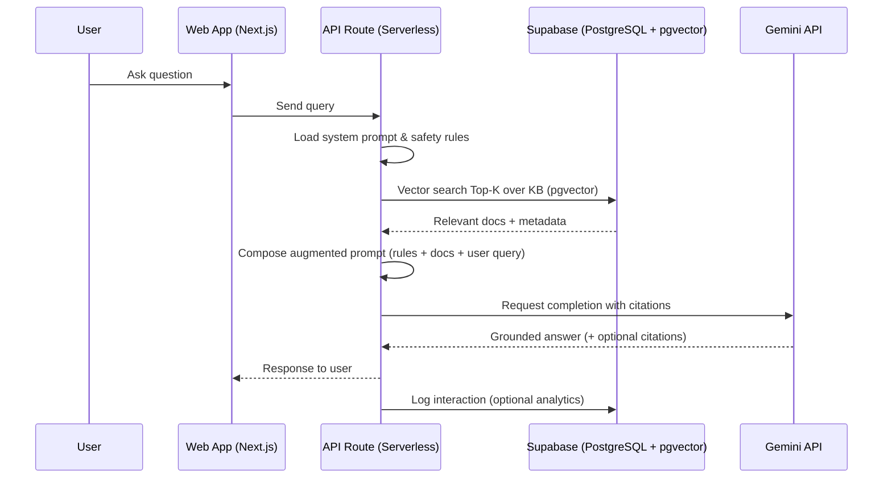
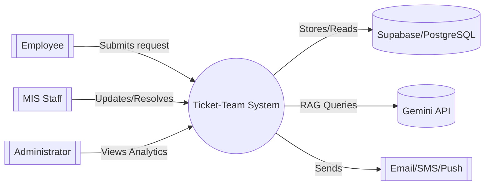
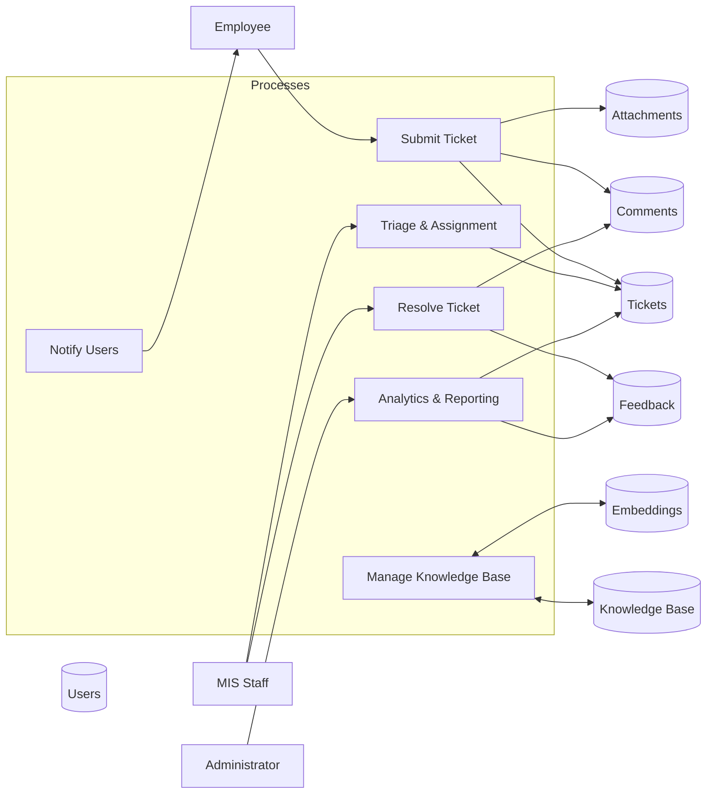

# System Architecture

> Overview of core system components and interactions.

## Table of Contents
- [1-B.2.1 System Architecture](#1-b21-system-architecture)
  - [Presentation Layer (Front-End)](#presentation-layer-front-end)
  - [Backend Layer (BaaS)](#backend-layer-baas)
  - [Intelligence Layer (AI Service)](#intelligence-layer-ai-service)
  - [Secure Intermediary (Serverless Functions)](#secure-intermediary-serverless-functions)
  - [Figure 3](#figure-3-proposed-system-architecture)
- [RAG Architecture Process Flow](#rag-architecture-process-flow)
- [Data Flow Diagrams](#data-flow-diagrams)
  - [Level 0 DFD (Context Diagram)](#level-0-dfd-context-diagram)
  - [Level 1 DFD](#level-1-dfd)
  - [Figures 6 and 7](#figures-6-and-7)
- [1-B.6 Security Considerations](#1-b6-security-considerations)
  - [Authentication](#authentication)
  - [Authorization (RLS)](#authorization-rls)
  - [Data Protection and Secure Communication](#data-protection-and-secure-communication)
- [References](#references)

## 1-B.2.1 System Architecture
The architecture is built upon a carefully selected stack of modern technologies, chosen to maximize development velocity while ensuring the platform is robust, scalable, and intelligent.

### Presentation Layer (Front-End)
The user interface will be developed using Next.js, a production-grade React framework. This choice is driven by its SSR capabilities for fast, responsive experiences and its component-based architecture for maintainability.

### Backend Layer (BaaS)
The project leverages Supabase as its primary backend, built on PostgreSQL. Supabase accelerates development by providing a database API, authentication, and real-time features. It includes the `pgvector` extension for storing and querying vector embeddings—essential for semantic search and RAG.

### Intelligence Layer (AI Service)
The innovative core is powered by Google's Gemini API, implemented via a Retrieval-Augmented Generation (RAG) architecture to ground responses in private institutional data and avoid hallucinations.

### Secure Intermediary (Serverless Functions)
Interactions with Gemini are routed through Next.js API Routes acting as a secure proxy so the Gemini API key is never exposed to clients.

### Figure 3: Proposed System Architecture
```mermaid
flowchart LR
  subgraph Presentation [Presentation (Next.js)]
    Web[Web App (SSR/CSR)]
  end
  subgraph API [API Routes (Serverless)]
    Proxy[Gemini Proxy + Server-only Secrets]
    AuthMW[Auth Middleware]
  end
  subgraph Supabase [Supabase / PostgreSQL]
    PostgREST[PostgREST]
    DB[(Database)]
    Auth[Auth]
    RLS[[Row Level Security]]
    Vec[pgvector]
    Store[(Storage - Attachments)]
    RT[Realtime]
  end
  Gemini[Gemini API]
  Notif[Email/SMS/Push]

  %% Client accesses
  Web --> PostgREST
  Web --> API

  %% API internals
  API --> Proxy
  API --> AuthMW

  %% API to Supabase (service role where needed)
  Proxy --> DB
  Proxy --> Vec
  Proxy --> Store
  Proxy --> Auth

  %% External services
  Proxy --> Gemini
  Proxy --> Notif

  %% Guards and flows
  PostgREST --> RLS
  RLS --> DB
  Vec --> DB
  RT --> DB
```

## RAG Architecture Process Flow
The RAG process functions like an "open-notes exam" for the AI: retrieve relevant documents, construct an augmented prompt (system prompt + retrieved context + user query), then call Gemini to produce a grounded answer.



## Data Flow Diagrams

### Level 0 DFD (Context Diagram)


### Level 1 DFD


### Figures 6 and 7
- Figure 6: Data Flow Diagram - Level 0
- Figure 7: Data Flow Diagram - Level 1

## 1-B.6 Security Considerations

### Authentication
Supabase Auth handles user authentication. Passwords are hashed with a modern algorithm (e.g., bcrypt). Sessions/tokens are securely managed to mitigate session hijacking.

### Authorization (RLS)
Role-Based Access Control enforced with PostgreSQL Row-Level Security (RLS). Example policy concept: users can view a ticket if they are the submitter or hold a `staff` role.

> **Note**: The RLS policy examples below use conceptual field names for illustration. In actual implementation, use `user_id` (not `submitter_id`) per the database schema, and refer to the `users.role` field directly rather than a separate `user_roles` table.

```sql
-- Example conceptual policy (adjust to your schema)
create policy "read_own_or_staff"
  on tickets for select
  using (
    auth.uid() = submitter_id
    or exists(
      select 1 from user_roles ur
      where ur.user_id = auth.uid() and ur.role in ('staff','admin','super_admin')
    )
  );
```

#### Concrete RLS Policies (illustrative)
Enable RLS and define policies per table. Adjust table/column names to your schema.

```sql
-- Users/roles helper (optional): user_roles(user_id, role)
-- Tickets
alter table tickets enable row level security;

-- SELECT: submitter or staff/admin
create policy tickets_select_self_or_staff on tickets
  for select using (
    submitter_id = auth.uid()
    or exists(
      select 1 from user_roles ur
      where ur.user_id = auth.uid() and ur.role in ('staff','admin','super_admin')
    )
  );

-- INSERT: only the authenticated user as submitter
create policy tickets_insert_self on tickets
  for insert with check (
    submitter_id = auth.uid()
  );

-- UPDATE: staff/admin can update; submitter cannot change protected fields
create policy tickets_update_staff on tickets
  for update using (
    exists(
      select 1 from user_roles ur
      where ur.user_id = auth.uid() and ur.role in ('staff','admin','super_admin')
    )
  );

-- Comments
alter table comments enable row level security;

-- SELECT: visible when parent ticket is visible
create policy comments_select_visible on comments
  for select using (
    exists(
      select 1 from tickets t
      where t.id = comments.ticket_id and (
        t.submitter_id = auth.uid()
        or exists(select 1 from user_roles ur where ur.user_id = auth.uid() and ur.role in ('staff','admin','super_admin'))
      )
    )
  );

-- INSERT: author is current user and parent ticket is visible
create policy comments_insert_author on comments
  for insert with check (
    author_id = auth.uid()
    and exists(
      select 1 from tickets t
      where t.id = comments.ticket_id and (
        t.submitter_id = auth.uid()
        or exists(select 1 from user_roles ur where ur.user_id = auth.uid() and ur.role in ('staff','admin','super_admin'))
      )
    )
  );

-- KB Articles
alter table kb_articles enable row level security;

-- SELECT: allow all authenticated users to read KB
create policy kb_articles_select_all on kb_articles for select using ( true );

-- INSERT/UPDATE: staff/admin only
create policy kb_articles_write_staff on kb_articles
  for all using (
    exists(select 1 from user_roles ur where ur.user_id = auth.uid() and ur.role in ('staff','admin','super_admin'))
  ) with check (
    exists(select 1 from user_roles ur where ur.user_id = auth.uid() and ur.role in ('staff','admin','super_admin'))
  );

-- Categories
alter table categories enable row level security;
create policy categories_select_all on categories for select using ( true );
create policy categories_write_staff on categories
  for all using (
    exists(select 1 from user_roles ur where ur.user_id = auth.uid() and ur.role in ('staff','admin','super_admin'))
  ) with check (
    exists(select 1 from user_roles ur where ur.user_id = auth.uid() and ur.role in ('staff','admin','super_admin'))
  );

-- Feedback
alter table feedback enable row level security;

-- INSERT: only ticket submitter can leave feedback
create policy feedback_insert_submitter on feedback
  for insert with check (
    exists(select 1 from tickets t where t.id = feedback.ticket_id and t.submitter_id = auth.uid())
  );

-- SELECT: super_admin only (employees cannot read their own)
create policy feedback_select_super_admin on feedback
  for select using (
    exists(select 1 from user_roles ur where ur.user_id = auth.uid() and ur.role = 'super_admin')
  );

-- Attachments
alter table attachments enable row level security;

-- SELECT: visible if parent ticket visible
create policy attachments_select_visible on attachments
  for select using (
    exists(select 1 from tickets t where t.id = attachments.ticket_id and (
      t.submitter_id = auth.uid()
      or exists(select 1 from user_roles ur where ur.user_id = auth.uid() and ur.role in ('staff','admin','super_admin'))
    ))
  );

-- INSERT: uploader must be ticket submitter or staff/admin
create policy attachments_insert_authorized on attachments
  for insert with check (
    exists(select 1 from tickets t where t.id = attachments.ticket_id and (
      t.submitter_id = auth.uid()
      or exists(select 1 from user_roles ur where ur.user_id = auth.uid() and ur.role in ('staff','admin','super_admin'))
    ))
  );
```

#### Users (Administration)

```sql
-- Users
alter table users enable row level security;

-- SELECT: user can read self; admin/super_admin can read all
create policy users_select_self on users for select using ( id = auth.uid() );
create policy users_select_admins on users for select using (
  exists(select 1 from user_roles ur where ur.user_id = auth.uid() and ur.role in ('admin','super_admin'))
);

-- INSERT: admin can create non-super; super_admin can create any
create policy users_insert_admin on users
  for insert with check (
    exists(select 1 from user_roles where user_id = auth.uid() and role = 'admin')
    and role <> 'super_admin'
  );
create policy users_insert_super on users
  for insert with check (
    exists(select 1 from user_roles where user_id = auth.uid() and role = 'super_admin')
  );

-- UPDATE: admin can update non-super and cannot set role to super_admin
create policy users_update_admin on users
  for update using (
    exists(select 1 from user_roles where user_id = auth.uid() and role = 'admin')
    and role <> 'super_admin'
  ) with check (
    role <> 'super_admin'
  );

-- UPDATE: super_admin can update any
create policy users_update_super on users
  for update using (
    exists(select 1 from user_roles where user_id = auth.uid() and role = 'super_admin')
  ) with check ( true );

-- No DELETE: prefer deactivation pattern
-- Suggested fields: users.deactivated_at timestamptz, users.deactivated_by uuid
```

### Deletion Strategy

- Tickets: no hard deletes; use status transitions (Closed/Canceled).
- Comments: immutable history — no UPDATE/DELETE policies.
- Attachments: soft delete only (e.g., `deleted_at`, `deleted_by`) via RPC; retain storage object or quarantine; show UI tombstone.
- KB Articles/Categories: allow unpublish/archived, no hard delete.
- Users: no hard delete; deactivate accounts (`deactivated_at`, `deactivated_by`).

### Data Protection and Secure Communication
- Gemini API key stored only in server-side environment variables; proxied via API Routes.
- All communication over HTTPS (TLS) between browser, Next.js, and Supabase.

## References
- See also: [Authentication](../04-api/authentication.md)
- See also: [Database Schema](./database-schema.md)
- See also: [User Flows](../03-features/user-flows.md)
- See also: [Ticket Lifecycle](./ticket-lifecycle.md)
- See also: [ADR 0004](./adr-0004.md)
- See also: [Feedback Access](./feedback-access.md)
