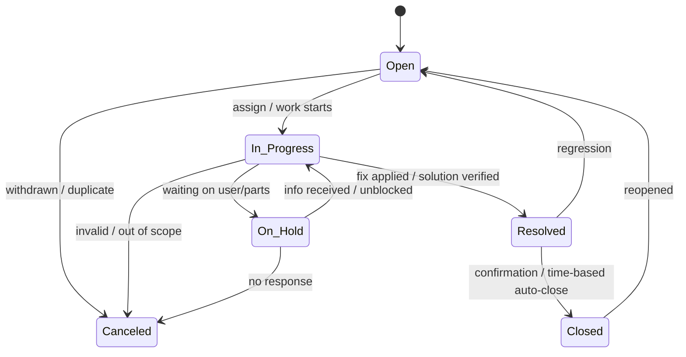

# Ticket Lifecycle

> State machine defining allowed ticket status transitions.

## Table of Contents
- [State Machine](#state-machine)
- [Transition Rules](#transition-rules)
- [References](#references)

## State Machine

## Transition Rules
- Only staff/admin may move `Open` → `In Progress`, `On Hold`, or `Canceled`.
- Submitter can request reopen: `Closed` → `Open` with justification.
- `Resolved` requires a documented solution and, when feasible, a linked KB article.
- Auto-close after a configurable period in `Resolved` with no submitter response.

## References
- See also: [System Architecture](./system-architecture.md)
- See also: [Feature List](../03-features/feature-list.md)
