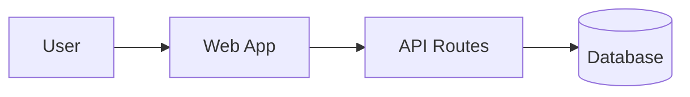

# Ticket Team Documentation

A centralized, AI-powered helpdesk ticketing system for La Verdad Christian College's MIS department, featuring intelligent RAG-based support and comprehensive ticket lifecycle management. Built with Next.js, Supabase, Gemini API, and shadcn/ui components.

**Last updated:** 2025-12-21 ✨ **PRODUCTION READY**  
**Project Status:** **100% Complete** - Ready for production deployment

---

## 🎯 **START HERE** - Current Status (Dec 21, 2025)

### 📊 Latest Status Report:
**[Current System Status](./CURRENT_SYSTEM_STATUS.md)** ⭐ **READ THIS FIRST**
- **30+ Complete Features** (100% functional)
- **31+ Application Pages** (all routes working)
- **30 Database Migrations** (all applied)
- **49+ Server Actions** (comprehensive backend)
- **Production Ready** ✅

### 🎉 Major Achievements:
- ✅ All core features complete and tested
- ✅ Security & preferences system implemented
- ✅ Performance monitoring dashboard
- ✅ AI observability tracking
- ✅ Help center with comprehensive content
- ✅ Email notification system
- ✅ Complete audit logging
- ✅ Session management & security

### 📈 Previous Status Reports (Historical):
1. **[Final Project Status](./FINAL_PROJECT_STATUS.md)** - Jan 21, 2025
2. **[Completion Update](./COMPLETION_UPDATE_JAN_21.md)** - Jan 21, 2025
3. **[Comprehensive Progress Report](./COMPREHENSIVE_PROGRESS_REPORT.md)** - Jan 21, 2025
4. **[Missing Features Analysis](./missing-features-analysis.md)** - Jan 21, 2025

---

## Quick Links

### Getting Started
- [Quick Start](./01-overview/quick-start.md)
- [Setup Guide](./01-overview/setup-guide.md)
- [Project Overview](./01-overview/project-overview.md)

### Architecture & Technical
- [System Architecture](./02-architecture/system-architecture.md)
- [Database Schema](./02-architecture/database-schema.md)
- [Folder Structure](./02-architecture/folder-structure.md)

### Features & Usage
- [Feature List](./03-features/feature-list.md)
- [User Flows](./03-features/user-flows.md)
- [API Endpoints](./04-api/endpoints.md)

### Status & Progress
- [Current System Status](./CURRENT_SYSTEM_STATUS.md) ⭐ **LATEST**
- [Pre-Production Checklist](./PRE_PRODUCTION_CHECKLIST.md)
- [Testing Checklist](./TESTING_CHECKLIST.md)

## Documentation Sections

### 📖 Overview
- [Project Overview](./01-overview/project-overview.md) - What is Ticket Team?
- [Setup Guide](./01-overview/setup-guide.md) - Installation and configuration
- [Quick Start](./01-overview/quick-start.md) - Get up and running fast
- [Glossary](./01-overview/glossary.md) - Terms and definitions

### 🏗️ Architecture
- [System Architecture](./02-architecture/system-architecture.md) - Overall system design
- [Database Schema](./02-architecture/database-schema.md) - Database structure and relationships
- [Folder Structure](./02-architecture/folder-structure.md) - Codebase organization
- [Ticket Lifecycle](./02-architecture/ticket-lifecycle.md) - Ticket workflow and states

### ✨ Features
- [Feature List](./03-features/feature-list.md) - Complete feature inventory
- [User Flows](./03-features/user-flows.md) - User journey and workflows

### 🔌 API Documentation
- [Endpoints](./04-api/endpoints.md) - API routes and usage
- [Authentication](./04-api/authentication.md) - Auth flows and security

### 🎨 Components & Styling
- [Component Library](./05-components/component-library.md) - Reusable UI components
- [Styling Guide](./05-components/styling-guide.md) - Design system and Tailwind usage

### 👨‍💻 Development
- [Coding Standards](./06-development/coding-standards.md) - Code style and conventions
- [Git Workflow](./06-development/git-workflow.md) - Version control practices
- [Testing](./06-development/testing.md) - Testing strategies
- [Deployment](./06-development/deployment.md) - Deployment guide

### 🔧 Troubleshooting
- [Common Issues](./07-troubleshooting/common-issues.md) - Known issues and solutions
- [Debugging](./07-troubleshooting/debugging.md) - Debugging techniques

### 🗺️ Roadmap & Status
- [Current System Status](./CURRENT_SYSTEM_STATUS.md) ⭐ **LATEST**
- [Pre-Production Checklist](./PRE_PRODUCTION_CHECKLIST.md)
- [Testing Checklist](./TESTING_CHECKLIST.md)
- [SMTP Setup Guide](./SMTP_SETUP_GUIDE.md)

### 📋 Architecture Decision Records (ADRs)
- [ADR 0001: Choose Next.js](./adr/0001-nextjs.md)
- [ADR 0002: Choose Supabase](./adr/0002-supabase.md)
- [ADR 0003: Choose Gemini API](./adr/0003-gemini-api.md)
- [ADR 0004: Adopt RAG Architecture](./adr/0004-RAG-architecture.md)

## Assets
You can embed Mermaid diagrams directly in markdown:

## Contributing to Docs
- Keep titles concise and descriptive.
- Prefer relative links.
- Include at least one example code block where applicable.

