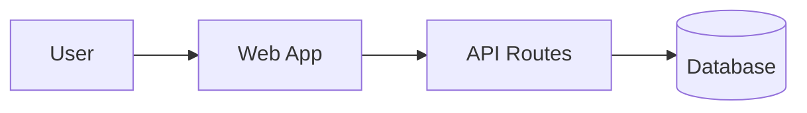

# Ticket Team Documentation

A centralized, AI-powered helpdesk ticketing system for La Verdad Christian College's MIS department, featuring intelligent RAG-based support and comprehensive ticket lifecycle management. Built with Next.js, Supabase, Gemini API, and shadcn/ui components.

**Last updated:** 2025-10-13

## Quick Links
- [Quick Start](./01-overview/quick-start.md)
- [Setup Guide](./01-overview/setup-guide.md)
- [Implementation Status](./08-roadmap/implementation-status.md)
- [Project Roadmap](./08-roadmap/roadmap.md)
- [Architecture Overview](./02-architecture/system-architecture.md)
- [API Endpoints](./04-api/endpoints.md)
- [Use Cases](./03-features/user-flows.md)
- [Security Considerations](./02-architecture/system-architecture.md#1-b6-security-considerations)

## Sections
- Overview
  - [Project Overview](./01-overview/project-overview.md)
  - [Setup Guide](./01-overview/setup-guide.md)
  - [Quick Start](./01-overview/quick-start.md)
  - [Glossary](./01-overview/glossary.md)
- Architecture
  - [System Architecture](./02-architecture/system-architecture.md)
  - [Database Schema](./02-architecture/database-schema.md)
  - [Folder Structure](./02-architecture/folder-structure.md)
  - [Ticket Lifecycle](./02-architecture/ticket-lifecycle.md)
- Features
  - [Feature List](./03-features/feature-list.md)
  - [User Flows](./03-features/user-flows.md)
- API
  - [Endpoints](./04-api/endpoints.md)
  - [Authentication](./04-api/authentication.md)
- Components
  - [Component Library](./05-components/component-library.md)
  - [Styling Guide](./05-components/styling-guide.md)
- Development
  - [Coding Standards](./06-development/coding-standards.md)
  - [Git Workflow](./06-development/git-workflow.md)
  - [Testing](./06-development/testing.md)
  - [Deployment](./06-development/deployment.md)
- Troubleshooting
  - [Common Issues](./07-troubleshooting/common-issues.md)
  - [Debugging](./07-troubleshooting/debugging.md)
- Roadmap
  - [Implementation Status](./08-roadmap/implementation-status.md)
  - [Project Roadmap](./08-roadmap/roadmap.md)
- ADRs
  - [ADR 0001: Choose Next.js](./adr/0001-nextjs.md)
  - [ADR 0002: Choose Supabase](./adr/0002-supabase.md)
  - [ADR 0003: Choose Gemini API](./adr/0003-gemini-api.md)
  - [ADR 0004: Adopt RAG Architecture](./adr/0004-RAG-architecture.md)

## Assets
You can embed Mermaid diagrams directly in markdown:

## Contributing to Docs
- Keep titles concise and descriptive.
- Prefer relative links.
- Include at least one example code block where applicable.

